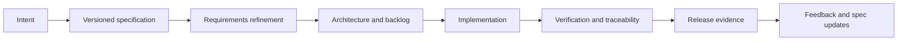
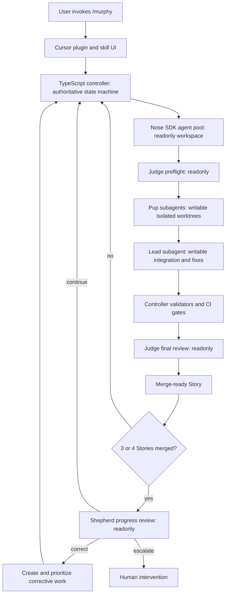

# Murphy Agent Kit

<p align="center">
  
</p>

Specification-Driven Development orchestration for Cursor.

`/murphy` is the UI. The TypeScript controller owns the workflow: state, gates, worktrees, models, evidence, leases, and recovery. Murphy conducts the crew. Nose, Pup, Lead, Judge, and Shepherd launch as top-level `@cursor/sdk` agents with explicit models and isolated worktrees. Skills guide behavior. They do not enforce it.

The first proving ground is a consumer-port profile set. Consumer-specific Jira fields, Quarkus rules, peer services, and env names (e.g. QA) live in profiles, never in the core. Core delivery posture is **non-production-first** — profiles map that to concrete environments.

## How a run moves



v1 ships the orchestration kernel, roles, adapters, profiles, evidence model, and qualification harness. Broader SDD workflows plug in later through the same contracts.

## Architecture



The controller launches every role as a local SDK agent with an explicit model and `cwd`. Role agents return structured requests; they do not nest-delegate children. That keeps dispatch off the model's judgment and inside the state machine.

### Roles

| Role | Access | Job |
|------|--------|-----|
| Nose | Readonly | Sniffs the repo; cheap discovery for everyone else |
| Pup | Writable in assigned Subtask worktree | Digs one Subtask |
| Lead | Writable on Story integration worktree | Gathers Pup work, fixes failures |
| Judge | Readonly | Preflight and final architecture/parity review |
| Shepherd | Readonly | Advisory glance after ≥3 merged Stories; pause only if blocking enabled or escalate |

No role approves its own work. No automatic merge or production action.

### What else is in the box

- Versioned project profiles for terminology, tracker fields, gates, and domain rules
- Versioned model profiles passed explicitly to `Agent.create`
- Adapters for specs, work tracking, source control, and evidence
- Command hooks for audit and prevention; controller validation still wins
- A dependency-aware parallel scheduler with resource claims, WIP limits, and merge waves
- Domain-neutral qualification cases plus a disposable Quarkus fixture for consumer-port

## Requirements

- macOS or Windows. Linux should work; not qualification-tested yet.
- Node.js >= 22, tested on 24 LTS
- pnpm 10
- Git with worktree support
- Cursor with local plugin support
- `CURSOR_API_KEY` for live SDK agent launches. Deterministic controller qualification paths do not need it.

## Install

```bash
pnpm install
pnpm build
pnpm run install:local
```

This copies the plugin into `~/.cursor/plugins/local/murphy-agent-kit`. Cursor rejects out-of-tree symlinks. Reload Cursor after install with **Developer: Reload Window**.

On Windows, if copy/install fails, enable Developer Mode and retry. Re-run `pnpm run install:local` after pulling changes.

```bash
pnpm murphy self-test
```

Full install, release pins, and env vars: [docs/INSTALL.md](docs/INSTALL.md).

## CLI

```bash
pnpm murphy --help
pnpm murphy self-test
pnpm murphy qualify
pnpm murphy status
```

In Cursor, invoke `/murphy`. The skill loads `WORKFLOW.md`, `HANDOFFS.md`, and the selected profile, then defers to the controller.

## Profiles

| Profile | When |
|---------|------|
| `profiles/consumer-port-bootstrap` | Repo setup, Jira completion, readonly discovery, playbook creation |
| `profiles/consumer-port-active` | Implementation lanes, only after discovery/playbook freeze |

Set `MURPHY_PROFILE` to pick a default. Keep consumer keys and Quarkus specifics out of core contracts.

## State

Durable SQLite state lives at `~/.murphy-agent-kit/state/murphy-agent-kit.db`. WAL mode, owner-only permissions on POSIX. Credentials never go there. Override the root with `MURPHY_STATE_DIR`. Schema version 2 migrates sheepdog role/state names in place.

## Repo map

```text
murphy-agent-kit/
├── skills/murphy/          # /murphy UI skill
├── roles/                  # Nose → Shepherd prompts
├── packages/controller/    # Authoritative CLI + state machine
├── packages/contracts/     # Schemas and role permissions
├── adapters/               # Specs, Jira, GitHub, evidence
├── profiles/               # Project policy packs
├── hooks/                  # Defense-in-depth only
├── qualification/          # Cases, fixtures, expected outputs
└── docs/                   # Install, security, recovery, release
```

## Docs

| Doc | Covers |
|-----|--------|
| [INSTALL.md](docs/INSTALL.md) | Local and immutable release install |
| [SECURITY.md](docs/SECURITY.md) | Credentials, redaction, role isolation |
| [RECOVERY.md](docs/RECOVERY.md) | Interrupted runs, leases, quarantine |
| [QUALIFICATION.md](docs/QUALIFICATION.md) | How to prove the kit before migration work |
| [RELEASE.md](docs/RELEASE.md) | Version/SHA approval and upgrade rules |

## License

UNLICENSED. Personal repository.
